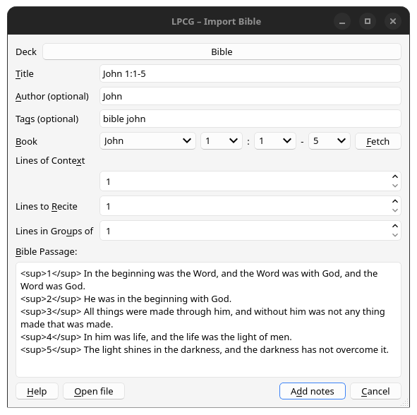
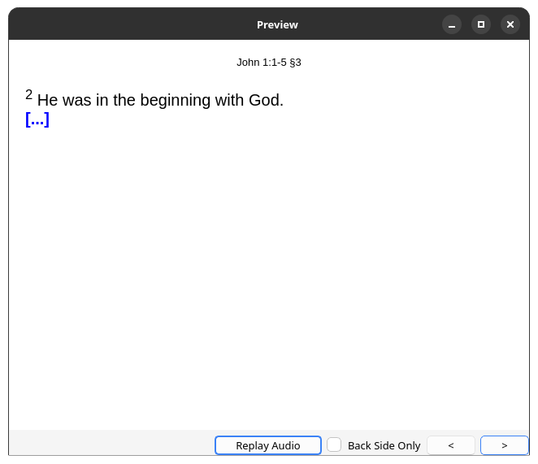
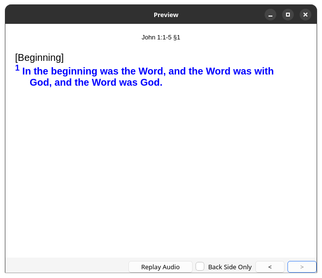
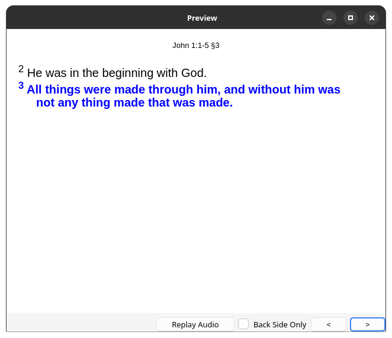

# Anki Bible Generator

This is a fork of [Anki Lyrics/Poetry Cloze Generator](https://github.com/sobjornstad/AnkiLPCG), specialised for memorising the Bible.

Long passages can be split into parts, with each part forming the prompt for recalling the next.
If you use the English Standard Version, passages can be imported and split into verses automatically.

## Installation and setup

You first need to clone the repository and generate a `.ankiaddon` file, which you can do with the following commands:

```sh
# Clone the repository
git clone https://github.com/shzcuber/AnkiBibleGenerator

# Install Python dependencies
cd AnkiBibleGenerator
python -m venv venv
pip install -r requirements.txt

# Build
make forms
make addon
```

This will generate `build.ankiaddon` in the same directory.
To import, open Anki and select Tools → Add-ons → Install from file.

If you want to automatically import passages from the ESV, you need to provide a free API key:
1. Get a free API key from https://api.esv.org/
2. In Anki: Tools → Add-ons → Select "Bible Generator" → Config
3. Set `esv_api_key` to `"Token your_key_here"`
4. Click OK

## Usage

To import a Bible passage, select Tools → Import Bible.

In the Bible passage field, each line will generate a different card for memorisation.
Standard usage is therefore to place a newline between each verse, but you can also split verses if they are particularly long.

## Screenshots







---

# Original README

Anki **Lyrics/Poetry Cloze Generator** (LPCG) is an add-on for [Anki][]
to make it easier to study long passages of verbatim text,
like poetry or song lyrics.

LPCG is licensed under the GNU AGPL version 3,
or at your option, any later version.

## How do I...

- **Install LPCG**: Visit its [AnkiWeb page][awp].
- **Use LPCG**: Visit the [documentation on Read the Docs][doc].
- **Get help with LPCG**: See the [getting help][] section of the documentation.
- **Contribute to LPCG**:
  Post on the `Issues` tab of this repository, or submit a pull request.
- **See what's changed**:
  See the [changelog][] page of the documentation.

[Anki]: https://apps.ankiweb.net
[awp]: https://ankiweb.net/shared/info/2084557901
[doc]: https://ankilpcg.readthedocs.io/en/latest/index.html
[getting help]: https://ankilpcg.readthedocs.io/en/latest/index.html#getting-help
[changelog]: https://ankilpcg.readthedocs.io/en/latest/changes.html

## Screenshots


